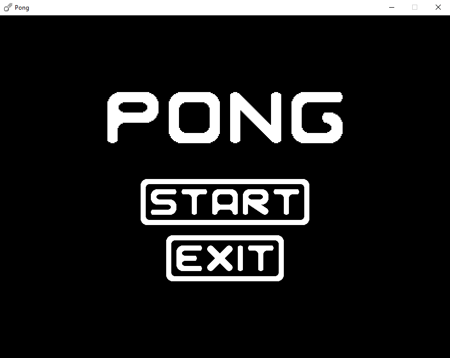
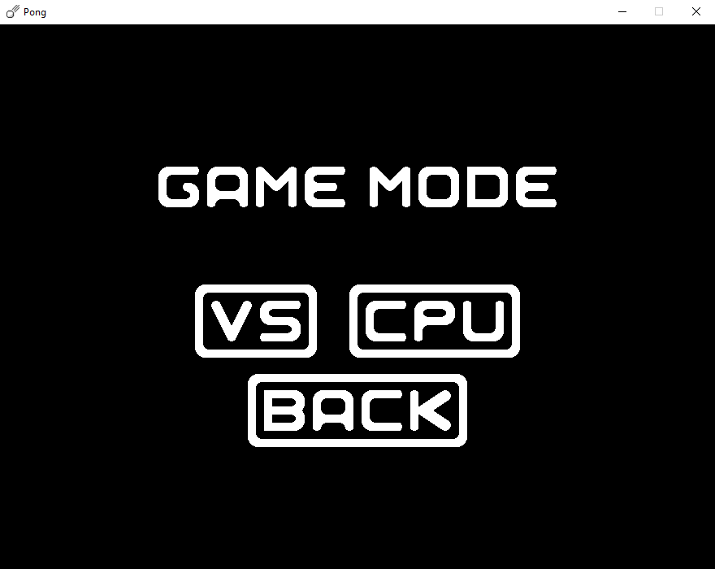
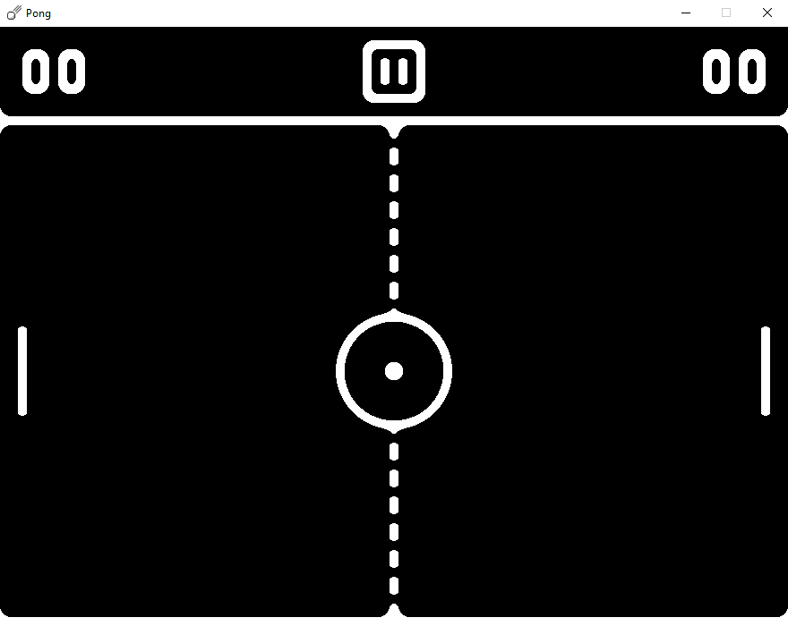
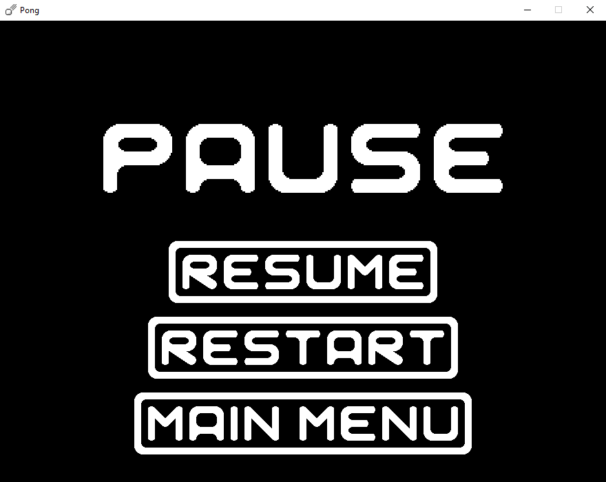

# PONG
I recreated [*Pong*](https://en.wikipedia.org/wiki/Pong) in Python using the Pygame library. I also created new desing of the game. I added a menu where you can choose if you want to play against a computer or another player. You can pause the game by pressing Esc key or by pressing the pause button and by pressing again Esc key you can resume the game. You can also restart the game or quit to the main menu.
## Game Design
### Main Menu

### Game Mode Screen

### Game

### Pause Menu
